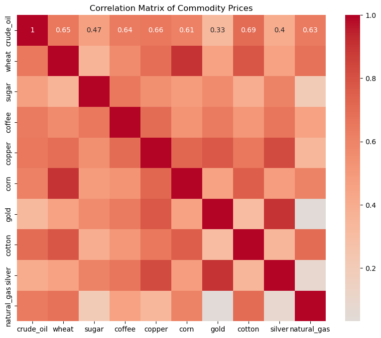
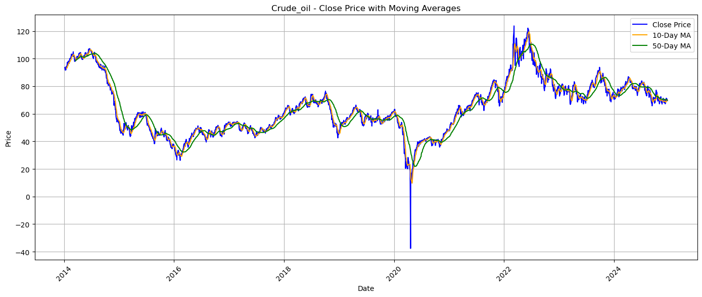
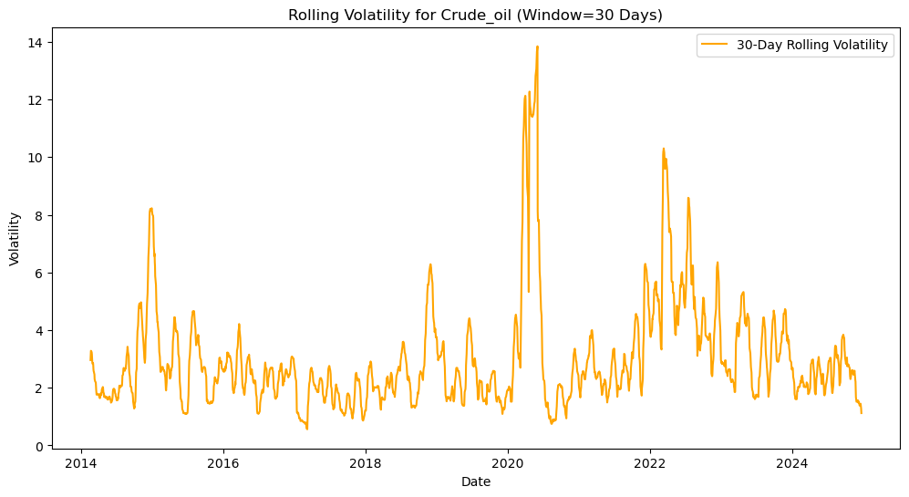
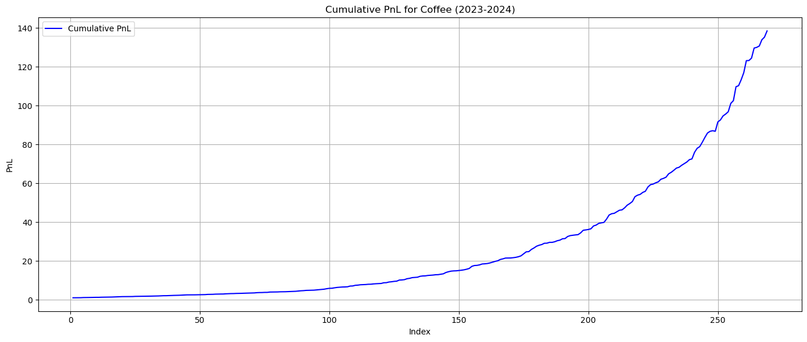
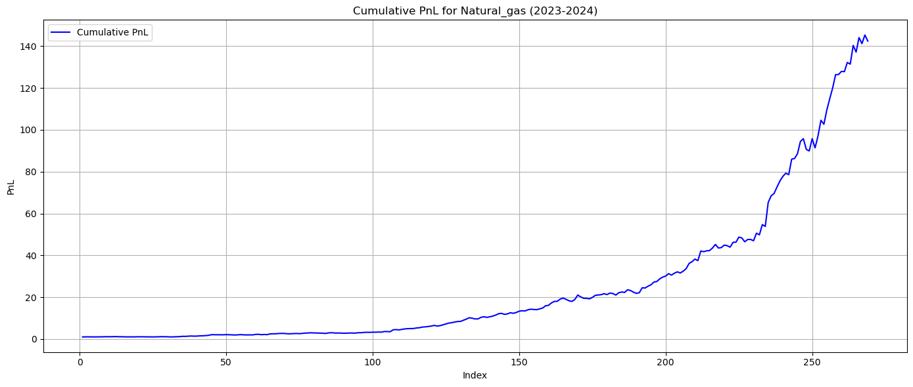

# 📈 Commodity Trader AI

**End-to-end quantitative trading pipeline covering 10 commodities — technical analysis, VADER news sentiment, 5 backtested strategies, XGBoost price prediction, and buy/sell signal execution with PnL tracking.**

> 10 commodities · 5 trading strategies · XGBoost with grid-search tuning · VADER + News API sentiment · Best result: Natural Gas +141.4% PnL

---

## 📌 Table of Contents

- [Project Overview](#-project-overview)
- [Pipeline Architecture](#-pipeline-architecture)
- [Exploratory Data Analysis](#-exploratory-data-analysis)
- [Backtesting Strategies](#-backtesting-strategies)
- [Machine Learning Model](#-machine-learning-model-xgboost)
- [Results](#-results)
- [Repository Structure](#-repository-structure)
- [How to Run](#-how-to-run)
- [API Key Setup](#-api-key-setup)
- [Dependencies](#-dependencies)
- [Limitations & Caveats](#-limitations--caveats)

---

## 📖 Project Overview

CommodityTraderAI is a systematic, data-driven trading framework that combines three signal sources — **technical indicators**, **news sentiment**, and **machine learning price predictions** — to generate and backtest trading signals across 10 global commodities:

`Crude Oil` · `Natural Gas` · `Gold` · `Silver` · `Copper` · `Coffee` · `Wheat` · `Sugar` · `Corn` · `Cotton`

Historical data (2014–2025) is sourced from Yahoo Finance via `yfinance`. The pipeline runs entirely in a single Jupyter notebook (`Commodity_Trader_AI.ipynb`) and a companion Python script (`Commodity_Trader_AI.py`).

---

## ⚙️ Pipeline Architecture

```
STAGE 1 — Data Fetching & Preprocessing
  └── yfinance: historical OHLCV for 10 commodities (2014–2025)
  └── Clean missing values, format dates, standardise columns

STAGE 2 — Exploratory Data Analysis (EDA)
  └── Price trend visualisation per commodity
  └── Rolling volatility (30-day window)
  └── Correlation matrix across all 10 commodities
  └── Technical indicators: MA, EMA, Bollinger Bands, RSI, MACD

STAGE 3 — Feature Engineering
  └── Daily returns, 10/50-day MAs, EMAs
  └── Bollinger Bands (upper/lower), RSI, MACD signal line
  └── Lag features and rolling statistics

STAGE 4 — Sentiment Analysis
  └── News API: fetch latest headlines per commodity
  └── VADER SentimentIntensityAnalyzer: compound polarity score
  └── Aggregate sentiment scores into daily signals

STAGE 5 — Strategy Backtesting (5 strategies × 10 commodities)
  └── Momentum, Range Trading, Breakout, Mean Reversion, Seasonal
  └── Metrics: cumulative return, CAGR

STAGE 6 — XGBoost Price Prediction
  └── Features: all engineered + sentiment score
  └── Grid search hyperparameter tuning
  └── Evaluation: MAE, RMSE on held-out test set

STAGE 7 — Signal Generation & Execution
  └── Buy / Sell / Hold signals from XGBoost predictions
  └── Simulated trade execution on 2023–2024 hidden data
  └── Cumulative PnL tracked per commodity
```

---

## 📊 Exploratory Data Analysis

### Commodity Price Correlation Matrix



Crude oil and copper show the strongest cross-commodity correlation (0.69), reflecting their shared sensitivity to global industrial demand cycles. Gold and silver show moderate correlation (0.40 vs crude oil), consistent with their safe-haven dynamics diverging from energy markets. Natural gas has the weakest correlations overall (0.33 with crude oil), making it the most independently tradeable commodity in this universe.

### Technical Indicators — Crude Oil (Moving Averages)



The 10-day and 50-day moving average crossovers clearly capture key trend inflections — the COVID-19 price collapse in April 2020 (crude oil briefly went negative) and the post-2022 geopolitical demand spike are both visible. These crossovers form the core buy/sell signals for the Momentum strategy.

### Rolling Volatility — Crude Oil (30-Day Window)



The 30-day rolling volatility chart shows the extreme volatility spike in April 2020 (peak ~14x normal), confirming why risk-adjusted strategies (Range Trading, Mean Reversion) outperform Momentum strategies for highly volatile commodities.

---

## 🔄 Backtesting Strategies

Five strategies were backtested across all 10 commodities using full historical data:

| Strategy | Logic |
|---|---|
| **Momentum** | Buy when price trends up, sell when it reverses (MA crossover) |
| **Range Trading** | Buy at support, sell at resistance within a price band |
| **Breakout** | Enter on confirmed price breakout above resistance / below support |
| **Mean Reversion** | Trade deviations from rolling average (Bollinger Band signals) |
| **Seasonal** | Trade recurring seasonal price patterns per commodity |

**Best strategy per commodity (by CAGR):**

| Commodity | Best Strategy | Cumulative Return | CAGR |
|---|---|---|---|
| Crude Oil | Breakout | 533.9% | 20.28% |
| Natural Gas | Range Trading | 496.2% | 19.55% |
| Wheat | Range Trading | 191.7% | 11.30% |
| Corn | Seasonal | 157.1% | 9.91% |
| Cotton | Range Trading | 145.3% | 9.39% |
| Sugar | Range Trading | 99.8% | 7.17% |
| Copper | Seasonal | 65.1% | 5.14% |
| Coffee | Mean Reversion | 54.5% | 4.44% |
| Gold | Mean Reversion | 6.4% | 0.62% |
| Silver | Range Trading | 2.5% | 0.25% |

Range Trading dominated across 5 commodities, reflecting the mean-reverting nature of most commodity price series over multi-year horizons.

---

## 🤖 Machine Learning Model (XGBoost)

An **XGBoost regressor** was trained on engineered features (technical indicators + VADER sentiment score) to predict next-day commodity prices.

**Training setup:**
- Features: daily returns, 10/50-day MA, EMA, Bollinger Bands, RSI, MACD, VADER compound score
- Tuning: grid search over `n_estimators`, `max_depth`, `learning_rate`, `subsample`
- Evaluation metrics: MAE and RMSE on a held-out test set per commodity
- Signal logic: Buy if predicted price > current price by threshold; Sell otherwise

The XGBoost signals were then executed on **2023–2024 hidden data** (not seen during training) to generate the final PnL figures.

---

## 📈 Results

### Final PnL — XGBoost Signal Execution (2023–2024)

| Commodity | Final PnL (%) |
|---|---|
| 🥇 Natural Gas | **+141.4%** |
| 🥈 Coffee | **+137.5%** |
| Crude Oil | +49.2% |
| Sugar | +48.1% |
| Wheat | +44.3% |
| Silver | +36.9% |
| Cotton | +22.3% |
| Corn | +14.0% |
| Gold | +5.9% |
| Copper | +2.6% |

### Cumulative PnL Charts

**Coffee — Cumulative PnL (2023–2024): +137.5%**



**Natural Gas — Cumulative PnL (2023–2024): +141.4%**



Natural gas and coffee were the strongest performers on out-of-sample data, driven by their high price volatility and strong trend signals captured by XGBoost. Gold and copper showed the weakest performance, consistent with their lower volatility and stronger mean-reversion behaviour that limits directional signals.

---

## 📁 Repository Structure

```
Commodity_Trader_AI/
│
├── Commodity_Trader_AI.ipynb       # Main notebook — full pipeline end-to-end
├── Commodity_Trader_AI.py          # Python script version of the pipeline
│
├── commodity_data/
│   ├── <commodity>.csv             # Raw OHLCV data from yfinance
│   ├── <commodity>_cleaned.csv     # Cleaned and formatted data
│   ├── <commodity>_features.csv    # Feature-engineered data
│   ├── commodity_strategy_cumulative_returns.csv  # All strategies × all commodities
│   ├── best_trading_strategy_per_commodity.csv    # Best strategy per commodity (CAGR)
│   └── final_trading_results.csv                 # XGBoost signal execution PnL
│
├── sentiment_data/
│   ├── cleaned_sentiment_data.csv  # Processed VADER sentiment scores
│   └── commodity_sentiment_summary.csv  # Aggregated sentiment per commodity
│
├── images/                         # Charts embedded in this README
├── requirements.txt
└── README.md
```

---

## 🚀 How to Run

1. **Clone the repository:**
   ```bash
   git clone https://github.com/aguru-venkata-saisantosh-patnaik/Commodity_Trader_AI.git
   cd Commodity_Trader_AI
   ```

2. **Install dependencies:**
   ```bash
   pip install -r requirements.txt
   ```

3. **Set up API keys** — see [API Key Setup](#-api-key-setup) below.

4. **Open and run the notebook:**
   ```bash
   jupyter notebook Commodity_Trader_AI.ipynb
   ```

5. Run all cells top to bottom. Data is fetched live from Yahoo Finance — full execution takes approximately **15–30 minutes** depending on internet speed and API rate limits.

> **Note:** The notebook saves intermediate CSV outputs to `commodity_data/` and `sentiment_data/` as it runs, so partial results are preserved if execution is interrupted.

---

## 🔑 API Key Setup

This project uses the **News API** to fetch commodity-related headlines for sentiment analysis.

1. Get a free API key at [newsapi.org](https://newsapi.org)
2. In the notebook, locate the News API configuration cell and set your key:
   ```python
   NEWS_API_KEY = "your_api_key_here"
   ```
   Or load it from an environment variable:
   ```python
   import os
   NEWS_API_KEY = os.getenv("NEWS_API_KEY")
   ```

> **Note:** The free News API tier limits requests to the past 30 days of articles. Historical sentiment data for the full backtest period was pre-computed and saved in `sentiment_data/`.

---

## 📦 Dependencies

```
yfinance          # Historical commodity price data (Yahoo Finance)
pandas            # Data manipulation
numpy             # Numerical operations
matplotlib        # Charting
seaborn           # Statistical visualisation
vaderSentiment    # News headline sentiment scoring
xgboost           # Price prediction model
scikit-learn      # Grid search, train/test split, evaluation metrics
requests          # News API calls
jupyter           # Notebook environment
```

Install all at once:
```bash
pip install -r requirements.txt
```

---

## ⚠️ Limitations & Caveats

- **Gross returns only** — no transaction costs, slippage, or bid-ask spreads deducted
- **Survivorship bias** — only currently tradeable commodities were included; delisted instruments are excluded
- **News API free tier** — limited to 30-day article history; historical sentiment was pre-computed as a proxy
- **VADER limitations** — rule-based English-only sentiment; may misclassify commodity-specific jargon or geopolitical nuance
- **XGBoost overfitting risk** — grid search was performed on training data; held-out 2023–2024 results mitigate but do not eliminate this risk
- **yfinance data quality** — occasional gaps and adjusted price inconsistencies handled via forward-fill and interpolation

---

*A full-stack quantitative trading research project — from raw price data to signal execution, with transparent backtesting and ML-driven predictions.*
